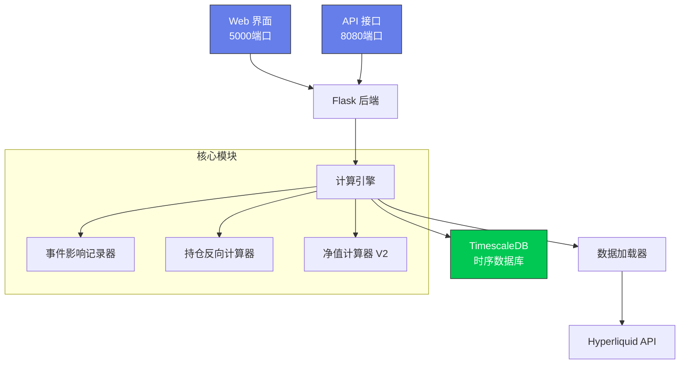
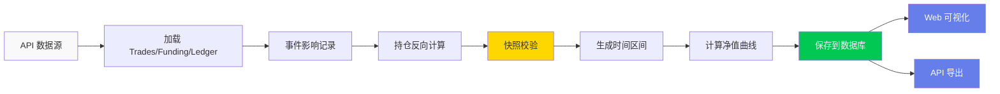

# 净值分析系统 V2

基于事件驱动的账户净值计算与可视化系统，支持 Hyperliquid 交易数据分析。

## ⚡ 核心功能

- 📊 **净值计算**：基于快照校验的历史净值曲线
- 📈 **数据可视化**：Web 界面实时展示净值、盈亏、资产分布
- 📜 **持仓追溯**：逆向计算每笔交易的历史持仓状态
- 🔌 **API 接口**：提供 RESTful API 供第三方调用
- 🚀 **Docker 部署**：一键部署到服务器

## 🎯 快速开始

### 本地运行

```bash
# 1. 安装依赖
pip install -r requirements.txt

# 2. 配置数据库（.env 文件）
cp docker/env.example .env

# 3. 启动 Web 服务
python start_web.py
```

访问：http://localhost:5000

### Docker 部署（推荐）

```bash
# 1. 配置环境
cp docker/env.example .env
nano .env  # 修改数据库密码

# 2. 一键启动
chmod +x docker-start.sh
./docker-start.sh
```

## 🏗️ 系统架构



## 📊 数据流程



## 📁 目录结构

```
caculate_net_value/
├── main/                    # 核心计算模块
│   ├── event_impact_recorder.py          # 事件影响记录
│   ├── calculate_positions_backward.py   # 持仓反向计算
│   ├── caculate_net_value_v2.py         # 净值计算引擎
│   ├── data_loader.py                    # 数据加载
│   └── net_value_timescale_manager.py   # 数据库管理
├── web/                     # Web 界面
│   ├── templates/          # HTML 模板
│   ├── static/            # CSS/JS 静态资源
│   └── api/               # Flask API 路由
├── net_value_api/          # 第三方 API 接口
│   ├── api.py             # RESTful API
│   ├── openapi.yaml       # OpenAPI 规范
│   └── server.py          # 独立 API 服务器
├── docker/                 # Docker 部署配置
├── docs/                   # 详细文档
└── config/                 # 配置文件
```

## 🛠️ 技术栈

- **后端**：Python 3.10、Flask
- **数据库**：TimescaleDB (PostgreSQL + 时序扩展)
- **前端**：HTML5、CSS3、JavaScript、ECharts
- **部署**：Docker、Docker Compose

## 📚 文档

| 文档 | 说明 |
|------|------|
| [Docker 部署指南](./docker/README.md) | Docker 使用说明 |
| [API 接口文档](./net_value_api/README.md) | RESTful API 详细说明 |
| [Apifox 导入指南](./net_value_api/APIFOX_IMPORT_GUIDE.md) | 导入接口到 Apifox |
| [净值计算逻辑](./docs/NET_VALUE_CALCULATOR_V2_LOGIC.md) | 算法详解 |
| [持仓计算逻辑](./docs/POSITION_BACKWARD_CALCULATOR_LOGIC.md) | 持仓追溯原理 |
| [已知问题](./docs/KNOWN_ISSUES.md) | 当前限制和已知问题 |

## 🔌 API 接口

### 获取可用时间区间
```bash
GET /netvalue/intervals
```

### 获取净值数据
```bash
GET /netvalue/data/{interval}/{address}?fields=all&from_first_trade=true&normalize=true
```

**支持的时间区间**：`1h`, `2h`, `4h`, `8h`, `12h`, `1d`

**详细文档**：查看 [net_value_api/README.md](./net_value_api/README.md)

## 🎨 界面预览

- 📈 **查看净值**：多维度图表展示（净值、资产、盈亏）
- ⚙️ **计算净值**：单个/批量地址计算，实时日志
- 📜 **过去持仓**：基于快照的历史持仓导出

## 🧪 测试

```bash
# 运行测试
python -m pytest test/

# 单独测试模块
python -m pytest test/test_calculate_positions_backward.py
```

## 🔧 常用命令

```bash
# 计算指定地址的净值
python calc.py 0x1234...abcd 1h

# 清理指定区间的数据
python clean_db.py 1h

# 启动 Web 服务
python start_web.py

# 启动 API 服务
python net_value_api/server.py
```

## ⚙️ 配置说明

主要配置文件：`.env`

```bash
# 数据库配置
TIMESCALE_HOST=localhost
TIMESCALE_PORT=5432
TIMESCALE_DB=net_value_db
TIMESCALE_USER=netvalue_user
TIMESCALE_PASSWORD=your_password

# 服务端口
WEB_PORT=5000
API_PORT=8080
```

## 🤝 贡献

欢迎提交 Issue 和 Pull Request！

## 📄 License

MIT License

---

**项目地址**：https://github.com/wyc7419/caculate_net_value_v2

